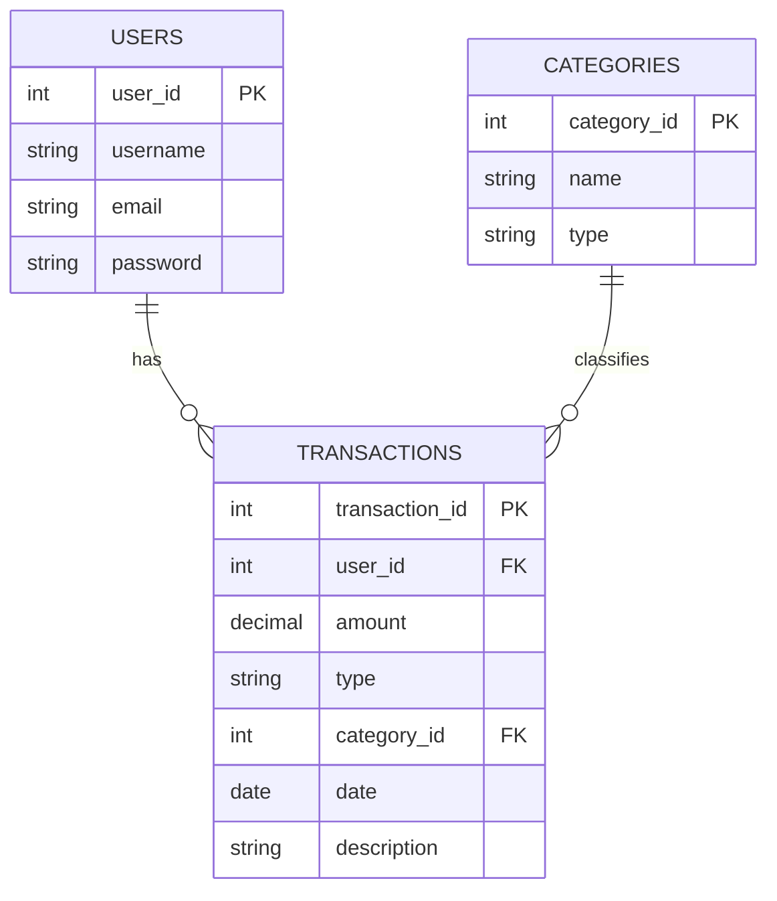

# Personal Finance Tracker

## Description

Personal Finance Tracker is a web application for students and individuals who want a simple way to track income and expenses. It helps users organize transactions, understand spending habits, and make better financial decisions.

## Also in this repository

[`alignment-pwa/`](alignment-pwa/) — **TrueLine**, a standalone offline PWA that
measures car wheel alignment (camber, toe, caster, SAI, Ackermann) using a
phone's accelerometer and gyroscope. It shares nothing with the finance tracker:
no build step, no dependencies, no server. See
[`alignment-pwa/README.md`](alignment-pwa/README.md).

## Requirements

### Authentication
- As a user, I want to register so I can create an account.
- As a user, I want to log in so I can access my data.
- As a user, I want to log out to secure my account.

### Transactions
- As a user, I want to add a transaction so I can track my spending.
- As a user, I want to view my transactions to see my financial history.
- As a user, I want to edit a transaction to fix mistakes.
- As a user, I want to delete a transaction when it is no longer needed.

### Categories
- As a user, I want to categorize transactions to organize my expenses.
- As a user, I want to filter transactions by category.

### Dashboard
- As a user, I want to see my total balance.
- As a user, I want to compare income and expenses.
- As a user, I want to view summaries of my spending.

## Entity Relationships

## API Routes

| Request | Action | Response | Description |
| --- | --- | --- | --- |
| `POST /api/auth/register` | `auth.register` | `201` + user data | Register a new user |
| `POST /api/auth/login` | `auth.login` | `200` + user data | Log a user in |
| `POST /api/auth/logout` | `auth.logout` | `200` | Log a user out |
| `GET /api/auth/me` | `auth.me` | `200` + current user | Get the logged-in user |
| `GET /api/transactions` | `transactions.index` | `200` + transactions | Get all user transactions |
| `GET /api/transactions/:id` | `transactions.show` | `200` + transaction | Get one transaction |
| `POST /api/transactions` | `transactions.create` | `201` + transaction | Create a transaction |
| `PUT /api/transactions/:id` | `transactions.update` | `200` + transaction | Update a transaction |
| `DELETE /api/transactions/:id` | `transactions.delete` | `200` | Delete a transaction |
| `GET /api/categories` | `categories.index` | `200` + categories | Get all categories |
| `POST /api/categories` | `categories.create` | `201` + category | Create a category |
| `DELETE /api/categories/:id` | `categories.delete` | `200` | Delete a category |
| `GET /api/dashboard/summary` | `dashboard.summary` | `200` + summary | Get balance summary |
| `GET /api/dashboard/monthly` | `dashboard.monthly` | `200` + monthly data | Get monthly spending breakdown |
| `GET /api/dashboard/categories` | `dashboard.categories` | `200` + category breakdown | Get spending by category |

## Wireframes

Add rough wireframes for the login, dashboard, and transactions pages.

## Framework and Tech
- Frontend: React
- Backend: Node.js and Express
- Database: Postgres
